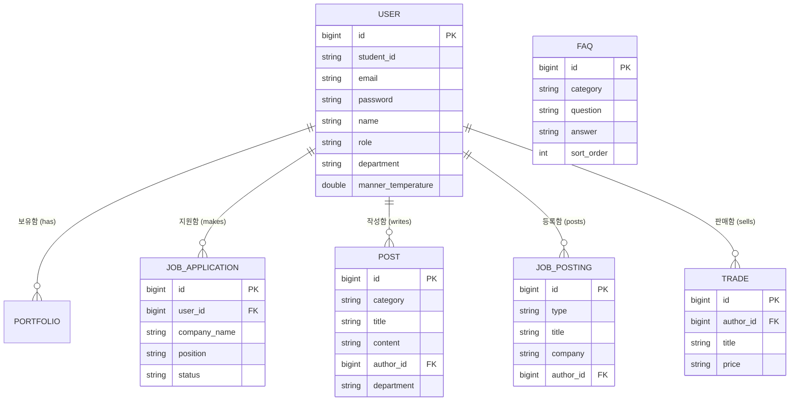

# polpol 아키텍처 및 ERD

## 1. 시스템 아키텍처

**polpol** 서비스는 인천 폴리텍 II 대학 AI융합소프트웨어과 학생들을 위한 취업 및 커뮤니티 특화 플랫폼입니다. 이 시스템은 클라이언트-서버 구조를 따릅니다.

### 기술 스택 (Tech Stack)
- **프론트엔드:** React (웹 앱 / 모바일 반응형)
- **백엔드:** Spring Boot (Java)
- **데이터베이스:** MySQL / PostgreSQL (사용자, 게시글, 거래내역 등 구조화된 데이터용 관계형 DB)
- **인증 및 인가:** Spring Security + JWT, 커스텀 이메일 인증 (`@office.kopo.ac.kr`)
- **스토리지 (저장소):** AWS S3 (또는 유사 클라우드 스토리지) - 포트폴리오 문서(.pdf, 이미지 등) 및 중고 거래 물품 이미지 저장.
- **AI 챗봇:** 학과 맞춤형 Q&A를 위한 로컬 또는 외부 API 연동 LLM.

### 주요 시스템 구성 (High-Level Components)
1. **클라이언트 (React):** UI/UX, 라우팅, 상태 관리를 담당하며 RESTful API를 통해 백엔드와 통신합니다.
2. **API 게이트웨이 / Nginx:** `www.pol.gg` 도메인에 대한 라우팅, SSL 적용(HTTPS) 및 로드 밸런싱.
3. **백엔드 서버 (Spring Boot):**
   - *인증 서비스 (Auth Service):* 이메일 인증, JWT 토큰 발급.
   - *사용자/커리어 서비스:* 포트폴리오 및 기업 지원 현황 관리.
   - *커뮤니티 서비스:* 공유 현황 피드, 자유 게시판, 자격증.
   - *마켓 서비스 (polbook):* 중고 물품 관리, 안전결제(에스크로), 1:1 채팅, 매너 온도.
   - *관리자 서비스:* 신고 처리, 커리큘럼/시간표 갱신.
4. **데이터베이스:** 영구적인 모든 데이터를 저장합니다.
5. **파일 스토리지:** 사용자가 업로드한 에셋(이력서, 책 사진 등)을 저장합니다.

---

## 2. 개체-관계 모델 (ERD) 개요

주요 데이터 엔티티와 그 관계에 대한 개념적 구조입니다.

### 핵심 엔티티 (Entities)

- **유저 (User) - 학생/관리자**
  - `id` (PK, String/UUID)
  - `student_id` (학번, 10자리 숫자)
  - `email` (@office.kopo.ac.kr)
  - `password_hash` (비밀번호 암호화)
  - `name` (이름)
  - `role` (권한: STUDENT, COUNCIL, ADMIN)
  - `manner_temperature` (매너 온도, Float)
  - `created_at`, `updated_at` (생성일, 수정일)

- **포트폴리오 (Portfolio)**
  - `id` (PK)
  - `user_id` (FK)
  - `is_public` (공개 여부, Boolean)
  - `is_representative` (대표 포트폴리오 여부, Boolean)
  - `file_url` (저장된 첨부 파일 주소, String)
  - 하위/연결 데이터: 프로젝트, 경력 사항, 자격증, 외국어, 학력, 기술 역량 등.

- **기업 지원 현황 (JobApplication)**
  - `id` (PK)
  - `user_id` (FK)
  - `company_name` (지원 기업)
  - `position` (지원 직무)
  - `applied_at` (지원 날짜)
  - `status` (지원 상태: APPLIED, INTERVIEWING, OFFERED, HIRED, REJECTED)
  - `location`, `salary` (근무지, 급여 정보)

- **채용 공고 (JobPosting) - 기업/프로젝트**
  - `id` (PK)
  - `author_id` (FK)
  - `type` (구분: CORPORATE, PROJECT)
  - `title` (제목)
  - `company` (기업명 - 기업형 전용)
  - `image_url`
  - `tags` (기술 스택 등)
  - `created_at`

- **게시글 (Post) - 자유, 질문, 잡담, 학생회 공지**
  - `id` (PK)
  - `author_id` (작성자, FK)
  - `category` (카테고리: 질문, 잡담, 공지 등)
  - `title` (제목)
  - `content` (내용)
  - `department` (작성자 학과)
  - `image_url`
  - `tags` (태그 리스트)
  - `views`, `likes` (조회수, 좋아요)
  - `created_at`

- **중고 거래 물품 (Trade)**
  - `id` (PK)
  - `author_id` (판매자, FK)
  - `title` (물품 제목)
  - `price` (판매 가격)
  - `imageUrl` (상품 이미지)
  - `tags` (태그: 급처, 전공서적 등)
  - `created_at`

- **자주 묻는 질문 (FAQ)**
  - `id` (PK)
  - `category` (분류)
  - `question` (질문)
  - `answer` (답변)
  - `sort_order` (출력 순서)

- **안전결제 에스크로 내역 (MarketTransaction)**
  - `id` (PK)
  - `item_id` (거래 물품, FK)
  - `buyer_id` (구매자, FK)
  - `amount` (거래 금액)
  - `status` (상태: 결제대기, 에스크로 보관중, 송금완료/거래완료, 취소됨)
  - `created_at`, `completed_at`

- **채팅방 (ChatRoom)**
  - `id` (PK)
  - `item_id` (중고 거래인 경우 연결, FK - nullable)
  - `participant1_id` (참여자1, FK)
  - `participant2_id` (참여자2, FK)

- **채팅 메시지 (ChatMessage)**
  - `id` (PK)
  - `room_id` (속한 채팅방, FK)
  - `sender_id` (보낸 사람, FK)
  - `content` (메시지 내용)
  - `created_at` (보낸 시간)

### ERD 구조도 (Mermaid)

